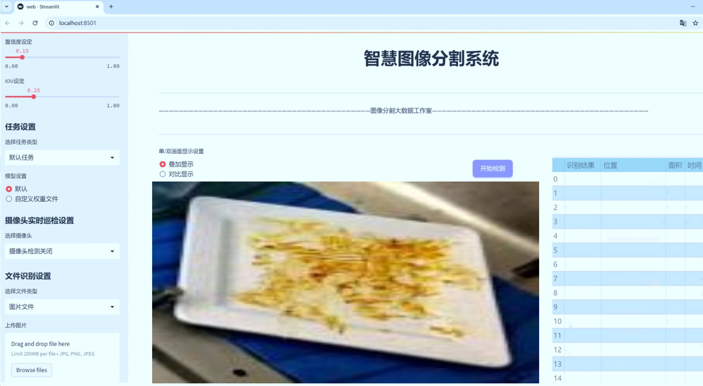
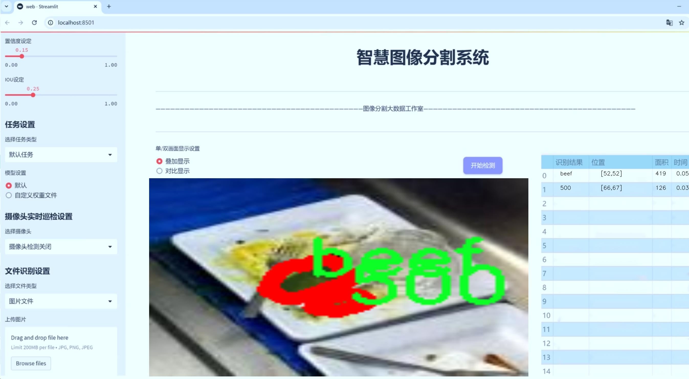
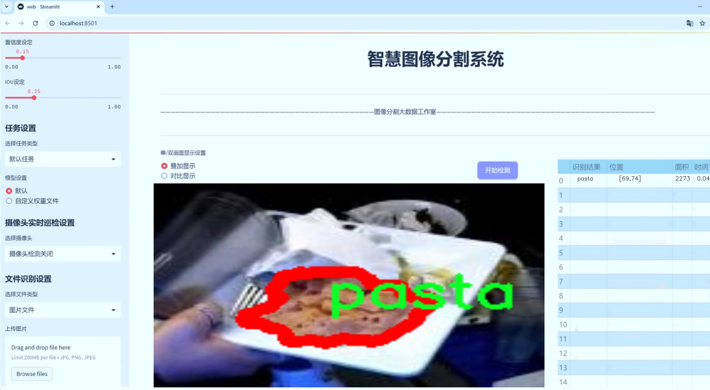
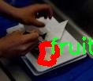
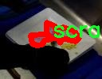
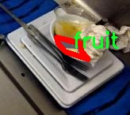

# 食品图像分割系统源码＆数据集分享
 [yolov8-seg-EfficientRepBiPAN＆yolov8-seg-GhostHGNetV2等50+全套改进创新点发刊_一键训练教程_Web前端展示]

### 1.研究背景与意义

项目参考[ILSVRC ImageNet Large Scale Visual Recognition Challenge](https://gitee.com/YOLOv8_YOLOv11_Segmentation_Studio/projects)

项目来源[AAAI Global Al lnnovation Contest](https://kdocs.cn/l/cszuIiCKVNis)

研究背景与意义

随着人工智能技术的迅猛发展，计算机视觉领域的应用日益广泛，尤其是在食品图像处理和分析方面。食品图像分割作为计算机视觉中的一个重要任务，旨在从复杂的图像中准确提取出食品物体的轮廓和类别信息。传统的图像处理方法往往依赖于手工特征提取，难以应对多样化的食品形态和复杂的背景环境。因此，基于深度学习的图像分割技术，尤其是YOLO（You Only Look Once）系列模型的应用，成为了当前研究的热点。

YOLOv8作为YOLO系列的最新版本，具备了更高的检测精度和更快的处理速度，其在实例分割任务中的表现尤为突出。通过改进YOLOv8模型，能够有效提升食品图像分割的准确性和实时性，从而为食品识别、营养分析和智能餐饮等应用提供有力支持。尤其是在食品安全和营养健康日益受到重视的背景下，准确的食品图像分割技术将为消费者提供更为可靠的信息，帮助他们做出更健康的饮食选择。

本研究所使用的数据集包含1300张食品图像，涵盖128个类别，涵盖了从常见的水果、蔬菜到各种主食和甜点等多种食品类型。这一丰富的类别设置为模型的训练和评估提供了良好的基础，使得研究成果具有较强的普适性和应用价值。通过对这些图像进行实例分割，不仅可以实现对单一食品的精确识别，还能在复杂场景中分离出不同食品，满足实际应用中的多样化需求。

此外，食品图像分割技术的进步也将推动相关领域的发展。例如，在智能厨房和自动化餐饮系统中，准确的食品识别和分割能够实现更高效的食材管理和菜品推荐；在健康监测和营养分析中，食品图像的精确分割将为用户提供更为准确的营养成分信息，从而促进健康饮食习惯的形成。因此，基于改进YOLOv8的食品图像分割系统不仅具有学术研究的意义，更在实际应用中展现出广阔的前景。

综上所述，基于改进YOLOv8的食品图像分割系统的研究，既是对现有计算机视觉技术的创新应用，也是对食品安全和健康饮食的积极响应。通过本研究，期望能够推动食品图像处理技术的发展，为相关领域的研究者和从业者提供新的思路和方法，从而在更大范围内提升食品图像分析的效率和准确性。

### 2.图片演示







##### 注意：由于此博客编辑较早，上面“2.图片演示”和“3.视频演示”展示的系统图片或者视频可能为老版本，新版本在老版本的基础上升级如下：（实际效果以升级的新版本为准）

  （1）适配了YOLOV8的“目标检测”模型和“实例分割”模型，通过加载相应的权重（.pt）文件即可自适应加载模型。

  （2）支持“图片识别”、“视频识别”、“摄像头实时识别”三种识别模式。

  （3）支持“图片识别”、“视频识别”、“摄像头实时识别”三种识别结果保存导出，解决手动导出（容易卡顿出现爆内存）存在的问题，识别完自动保存结果并导出到tempDir中。

  （4）支持Web前端系统中的标题、背景图等自定义修改，后面提供修改教程。

  另外本项目提供训练的数据集和训练教程,暂不提供权重文件（best.pt）,需要您按照教程进行训练后实现图片演示和Web前端界面演示的效果。

### 3.视频演示

[3.1 视频演示](https://www.bilibili.com/video/BV1h92JYhENe/)

### 4.数据集信息展示

##### 4.1 本项目数据集详细数据（类别数＆类别名）

nc: 82
names: ['500', '501', '502', '503', 'arrabiata', 'bacon', 'bagel', 'beans', 'beef', 'biscuit', 'black_beans', 'bread', 'breadstick', 'breakfast_sandwich', 'broccoli', 'bun', 'burger', 'burger_patty', 'carrots', 'cauliflower', 'cereal', 'chicken', 'chicken_nuggets', 'chicken_sausage_patty', 'chicken_tenders', 'cookies', 'creamed_spinach', 'cucumber', 'curry', 'dessert', 'dinner_roll', 'donut', 'fries', 'fruit', 'granola', 'grits', 'ham', 'hash_brown', 'hot_dog', 'ice_cream', 'ice_cream_cone', 'lettuce', 'meatballs', 'meatless_chicken_tenders', 'milk', 'mushroom', 'naan', 'nacho_cheese', 'oatmeal', 'olives', 'omelette', 'pancake', 'pasta', 'pickle', 'pizza', 'pizza_crust', 'poboy', 'popcorn_shrimp', 'potato', 'potstickers', 'pretzel', 'quiche', 'ravioli', 'rice', 'salad', 'sandwich', 'sausage', 'sausage_patty', 'scrambled_eggs', 'smoothie', 'soup', 'steak', 'stuffed_pepper', 'tater_tots', 'toast', 'tofu', 'tomato', 'tortilla', 'unknown', 'vegetables', 'waffle', 'yogurt']


##### 4.2 本项目数据集信息介绍

数据集信息展示

在本研究中，我们采用了名为“9_6_Final”的数据集，以训练和改进YOLOv8-seg的食品图像分割系统。该数据集包含了丰富多样的食品类别，涵盖了82种不同的食品项。这些类别的多样性不仅反映了现代饮食的丰富性，也为计算机视觉模型的训练提供了广泛的样本基础，旨在提升模型在实际应用中的准确性和鲁棒性。

数据集中包含的类别从常见的主食到各种美味的配菜，具体包括：面包、汉堡、比萨、鸡肉、牛肉、蔬菜等。每个类别都具有独特的视觉特征，这使得图像分割任务变得更加复杂和富有挑战性。例如，汉堡的层次结构和丰富的配料使其在图像中具有明显的特征，而蔬菜如西兰花和胡萝卜则因其形状和颜色的多样性而需要更为精细的分割技术。

在具体的类别列表中，我们可以看到诸如“arrabiata”、“bacon”、“bagel”等多种食品，这些食品不仅在外观上各具特色，同时在文化和地域上也有着不同的背景。数据集中的“dessert”类别则进一步丰富了模型的学习内容，使其能够处理甜点类食品的图像分割，这对于开发综合性的食品识别系统至关重要。

此外，数据集中还包括了一些相对较为特殊的食品类别，如“nacho_cheese”、“popcorn_shrimp”和“potstickers”，这些类别的存在为模型提供了更为复杂的场景，以便于提升其在多样化食品图像中的表现能力。通过对这些不同类别的学习，YOLOv8-seg模型将能够更好地理解和分割食品图像，进而应用于食品识别、营养分析等实际场景。

数据集的设计考虑到了食品图像的多样性和复杂性，确保了每个类别都有足够的样本量以支持深度学习模型的训练。每个类别的图像都经过精心挑选，确保其在视觉上具有代表性，从而使得模型在训练过程中能够有效地学习到每种食品的特征。此外，数据集还考虑到了不同的拍摄角度、光照条件和背景干扰，这些因素都可能影响图像分割的效果。

总之，“9_6_Final”数据集为改进YOLOv8-seg的食品图像分割系统提供了一个坚实的基础。通过对82种食品类别的深入学习，模型将能够在多样化的食品图像中实现更高的分割精度和更强的适应能力。这不仅有助于推动食品图像处理技术的发展，也为未来的智能饮食系统奠定了基础。









### 5.全套项目环境部署视频教程（零基础手把手教学）

[5.1 环境部署教程链接（零基础手把手教学）](https://www.bilibili.com/video/BV1jG4Ve4E9t/?vd_source=bc9aec86d164b67a7004b996143742dc)


[5.2 安装Python虚拟环境创建和依赖库安装视频教程链接（零基础手把手教学）](https://www.bilibili.com/video/BV1nA4VeYEze/?vd_source=bc9aec86d164b67a7004b996143742dc)

### 6.手把手YOLOV8-seg训练视频教程（零基础小白有手就能学会）

[6.1 手把手YOLOV8-seg训练视频教程（零基础小白有手就能学会）](https://www.bilibili.com/video/BV1cA4VeYETe/?vd_source=bc9aec86d164b67a7004b996143742dc)


按照上面的训练视频教程链接加载项目提供的数据集，运行train.py即可开始训练



     Epoch   gpu_mem       box       obj       cls    labels  img_size
     1/200     0G   0.01576   0.01955  0.007536        22      1280: 100%|██████████| 849/849 [14:42<00:00,  1.04s/it]
               Class     Images     Labels          P          R     mAP@.5 mAP@.5:.95: 100%|██████████| 213/213 [01:14<00:00,  2.87it/s]
                 all       3395      17314      0.994      0.957      0.0957      0.0843

     Epoch   gpu_mem       box       obj       cls    labels  img_size
     2/200     0G   0.01578   0.01923  0.007006        22      1280: 100%|██████████| 849/849 [14:44<00:00,  1.04s/it]
               Class     Images     Labels          P          R     mAP@.5 mAP@.5:.95: 100%|██████████| 213/213 [01:12<00:00,  2.95it/s]
                 all       3395      17314      0.996      0.956      0.0957      0.0845

     Epoch   gpu_mem       box       obj       cls    labels  img_size
     3/200     0G   0.01561    0.0191  0.006895        27      1280: 100%|██████████| 849/849 [10:56<00:00,  1.29it/s]
               Class     Images     Labels          P          R     mAP@.5 mAP@.5:.95: 100%|███████   | 187/213 [00:52<00:00,  4.04it/s]
                 all       3395      17314      0.996      0.957      0.0957      0.0845


### 7.50+种全套YOLOV8-seg创新点代码加载调参视频教程（一键加载写好的改进模型的配置文件）

[7.1 50+种全套YOLOV8-seg创新点代码加载调参视频教程（一键加载写好的改进模型的配置文件）](https://www.bilibili.com/video/BV1Hw4VePEXv/?vd_source=bc9aec86d164b67a7004b996143742dc)

### 8.YOLOV8-seg图像分割算法原理

原始YOLOv8-seg算法原理

YOLOv8-seg算法是Ultralytics在2023年推出的一款先进的目标检测与图像分割模型，作为YOLO系列的最新版本，它集成了前几代YOLO模型的优点，尤其是在设计架构、损失函数和标签分配策略方面的创新，使其在实时检测领域达到了新的高度。YOLOv8-seg不仅在速度和精度上表现出色，还在灵活性和易用性方面进行了优化，适用于各种视觉识别任务，包括目标检测、图像分割和图像分类。

YOLOv8-seg的网络结构主要由输入层、主干网络、颈部和头部四个部分组成。输入层默认接受640x640的图像，但在实际应用中，YOLOv8-seg采用自适应图像缩放技术，以适应不同长宽比的图像。这种缩放方式通过将较长的一边按比例缩小到指定尺寸，并对缩小后的短边进行填充，从而减少信息冗余，提高目标检测和推理的速度。此外，在训练过程中，YOLOv8-seg使用了Mosaic图像增强技术，通过随机将四张图像拼接成一张新图像，迫使模型学习不同位置和周围像素的特征，从而有效提升预测精度。

在主干网络部分，YOLOv8-seg借鉴了YOLOv7中的ELAN模块设计，将YOLOv5中的C3模块替换为C2F模块。C2F模块通过并行多个梯度流分支，确保在保持轻量化的同时，获得更丰富的梯度信息，从而提高模型的精度和响应速度。相较于YOLOv5的结构，C2F模块的引入使得YOLOv8-seg在特征提取方面更具优势，能够更好地捕捉到图像中的重要信息。

颈部结构是YOLOv8-seg的另一个重要组成部分。在这一部分，YOLOv8-seg对YOLOv5的设计进行了改进，去除了多余的卷积连接层，直接对主干网络不同阶段输出的特征进行上采样。这种简化不仅提高了计算效率，还增强了特征融合的效果，使得模型在处理复杂场景时能够更好地保留关键信息。

在头部结构方面，YOLOv8-seg的创新最为显著。与YOLOv5的Coupled-Head结构不同，YOLOv8-seg采用了Decoupled-Head结构，将检测和分类的卷积分开处理。输入特征图首先通过两个1x1的卷积模块进行降维，然后分别进行类别预测和边界框位置及IoU（交并比）预测。这种解耦设计不仅提高了模型的灵活性，还使得损失函数的设计更加合理。YOLOv8-seg在分类分支中使用BCELoss（Binary Cross Entropy Loss）作为损失函数，而在边界框回归分支中则采用DFL（Distribution Focal Loss）和CIoULoss（Complete Intersection over Union Loss），以便更快地聚焦于标签附近的数值，提高模型的收敛速度和精度。

YOLOv8-seg还抛弃了传统的Anchor-Based（基于锚框）方法，转而采用Anchor-Free（无锚框）策略。这一转变使得目标检测的过程变得更加灵活，模型不再依赖于预设的锚框进行目标定位，而是将目标检测转化为关键点检测。这种方法不仅减少了计算复杂度，还增强了模型的泛化能力，使其能够适应不同数据集的特征。

YOLOv8-seg的设计理念强调了快速、准确和易用的特性，使其成为目标检测和图像分割任务的理想选择。其在COCOval2017数据集上的表现进一步证明了这一点，单模型单尺度测试中，YOLOv8-seg展示了卓越的性能，标志着目标检测领域的一次重大突破。随着YOLOv8-seg的推出，研究人员和开发者能够更高效地进行目标检测和图像分割，推动了相关领域的快速发展。

在实际应用中，YOLOv8-seg被广泛应用于农业、工业、安防等多个领域。例如，在苹果采摘的场景中，YOLOv8-seg能够自动检测和定位苹果，为自动采摘机器人提供精准的视觉指导。同时，结合蚁群算法进行路径规划，进一步提升了自动采摘的效率。这种应用展示了YOLOv8-seg在实际场景中的强大能力，预示着其在未来的广泛应用潜力。

总之，YOLOv8-seg算法通过对前代YOLO模型的创新与改进，提供了一种高效、灵活的解决方案，适应了日益复杂的目标检测需求。其在结构设计、损失函数、标签分配等方面的创新，使得YOLOv8-seg不仅在学术研究中具有重要意义，也在实际应用中展现出广泛的前景。随着技术的不断进步，YOLOv8-seg无疑将为目标检测和图像分割领域带来更多的可能性与挑战。


### 9.系统功能展示（检测对象为举例，实际内容以本项目数据集为准）

图9.1.系统支持检测结果表格显示

  图9.2.系统支持置信度和IOU阈值手动调节

  图9.3.系统支持自定义加载权重文件best.pt(需要你通过步骤5中训练获得)

  图9.4.系统支持摄像头实时识别

  图9.5.系统支持图片识别

  图9.6.系统支持视频识别

  图9.7.系统支持识别结果文件自动保存

  图9.8.系统支持Excel导出检测结果数据


### 10.50+种全套YOLOV8-seg创新点原理讲解（非科班也可以轻松写刊发刊，V11版本正在科研待更新）

#### 10.1 由于篇幅限制，每个创新点的具体原理讲解就不一一展开，具体见下列网址中的创新点对应子项目的技术原理博客网址【Blog】：


[10.1 50+种全套YOLOV8-seg创新点原理讲解链接](https://gitee.com/qunmasj/good)

#### 10.2 部分改进模块原理讲解(完整的改进原理见上图和技术博客链接)【此小节的图要是加载失败请移步原始博客查看，链接：https://blog.csdn.net/cheng2333333?type=blog】

### YOLOv8简介
YOLOv8是一种目标检测模型，是基于YOLO (You Only Look Once)系列算法发展而来的最新版本。它的核心思想是将目标检测任务转化为一个回归问题，通过单次前向传播即可直接预测出图像中的多个目标的位置和类别。
YOLOv8的网络结构采用了Darknet作为其主干网络，主要由卷积层和池化层构成。与之前的版本相比，YOLOv8在网络结构上进行了改进，引入了更多的卷积层和残差模块，以提高模型的准确性和鲁棒性。
YOLOv8采用了一种特征金字塔网络(Feature Pyramid Network,FPN)的结构，通过在不同层级上融合多尺度的特征信息，可以对不同尺度的目标进行有效的检测。此外，YOLOv8还引入了一种自适应感知域(Adaptive Anchors
的机制，通过自适应地学习目标的尺度和
长宽比，提高了模型对于不同尺度和形状目标的检测效果。
总体来说，YOLOv8结构模型综合了多个先进的目标检测技术，在保证检测速度的同时提升了检测精度和鲁棒性，被广泛应用于实时目标检测任务中。


#### yolov8网络模型结构图

YOLOv8 (You Only Look Once version 8)是一种目标检测算法，它在实时场景下可以快速准确地检测图像中的目标。
YOLOv8的网络模型结构基于Darknet框架，由一系列卷积层、池化层和全连接层组成。主要包含以下几个组件:
1.输入层:接收输入图像。
2.卷积层:使用不同尺寸的卷积核来提取图像特征。
3.残差块(Residual blocks):通过使用跳跃连接(skip connections）来解决梯度消失问题，使得网络更容易训练。
4.上采样层(Upsample layers):通过插值操作将特征图的尺寸放大，以便在不同尺度上进行目标检测。
5.池化层:用于减小特征图的尺寸，同时保留重要的特征。
6.1x1卷积层:用于降低通道数，减少网络参数量。
7.3x3卷积层:用于进—步提取和组合特征。
8.全连接层:用于最后的目标分类和定位。
YOLOv8的网络结构采用了多个不同尺度的特征图来检测不同大小的目标，从而提高了目标检测的准确性和多尺度性能。
请注意，YOLOv8网络模型结构图的具体细节可能因YOLO版本和实现方式而有所不同。


#### yolov8模型结构
YOLOv8模型是一种目标检测模型，其结构是基于YOLOv3模型进行改进的。模型结构可以分为主干网络和检测头两个部分。
主干网络是一种由Darknet-53构成的卷积神经网络。Darknet-53是一个经过多层卷积和残差连接构建起来的深度神经网络。它能够提取图像的特征信息，并将这些信息传递给检测头。
检测头是YOLOv8的关键部分，它负责在图像中定位和识别目标。检测头由一系列卷积层和全连接层组成。在每个检测头中，会生成一组锚框，并针对每个锚框预测目标的类别和位置信息。
YOLOv8模型使用了预训练的权重，其中在COCO数据集上进行了训练。这意味着该模型已经通过大规模数据集的学习，具有一定的目标检测能力。

### RT-DETR骨干网络HGNetv2简介
#### RT-DETR横空出世
前几天被百度的RT-DETR刷屏，参考该博客提出的目标检测新范式对原始DETR的网络结构进行了调整和优化，以提高计算速度和减小模型大小。这包括使用更轻量级的基础网络和调整Transformer结构。并且，摒弃了nms处理的detr结构与传统的物体检测方法相比，不仅训练是端到端的，检测也能端到端，这意味着整个网络在训练过程中一起进行优化，推理过程不需要昂贵的后处理代价，这有助于提高模型的泛化能力和性能。


当然，人们对RT-DETR之所以产生浓厚的兴趣，我觉得大概率还是对YOLO系列审美疲劳了，就算是出到了YOLO10086，我还是只想用YOLOv5和YOLOv7的框架来魔改做业务。。

#### 初识HGNet
看到RT-DETR的性能指标，发现指标最好的两个模型backbone都是用的HGNetv2，毫无疑问，和当时的picodet一样，骨干都是使用百度自家的网络。初识HGNet的时候，当时是参加了第四届百度网盘图像处理大赛，文档图像方向识别专题赛道，简单来说，就是使用分类网络对一些文档截图或者图片进行方向角度分类。


当时的方案并没有那么快定型，通常是打榜过程发现哪个网络性能好就使用哪个网络做魔改，而且木有显卡，只能蹭Ai Studio的平台，不过v100一天8小时的实验时间有点短，这也注定了大模型用不了。 

流水的模型，铁打的炼丹人，最后发现HGNet-tiny各方面指标都很符合我们的预期，后面就一直围绕它魔改。当然，比赛打榜是目的，学习才是享受过程，当时看到效果还可以，便开始折腾起了HGNet的网络架构，我们可以看到，PP-HGNet 针对 GPU 设备，对目前 GPU 友好的网络做了分析和归纳，尽可能多的使用 3x3 标准卷积（计算密度最高），PP-HGNet是由多个HG-Block组成，细节如下：


ConvBNAct是啥？简单聊一聊，就是Conv+BN+Act，CV Man应该最熟悉不过了：
```python
class ConvBNAct(TheseusLayer):
    def __init__(self,
                 in_channels,
                 out_channels,
                 kernel_size,
                 stride,
                 groups=1,
                 use_act=True):
        super().__init__()
        self.use_act = use_act
        self.conv = Conv2D(
            in_channels,
            out_channels,
            kernel_size,
            stride,
            padding=(kernel_size - 1) // 2,
            groups=groups,
            bias_attr=False)
        self.bn = BatchNorm2D(
            out_channels,
            weight_attr=ParamAttr(regularizer=L2Decay(0.0)),
            bias_attr=ParamAttr(regularizer=L2Decay(0.0)))
        if self.use_act:
            self.act = ReLU()
 
    def forward(self, x):
        x = self.conv(x)
        x = self.bn(x)
        if self.use_act:
            x = self.act(x)
        return x 
```
且标准卷积的数量随层数深度增加而增多，从而得到一个有利于 GPU 推理的骨干网络，同样速度下，精度也超越其他 CNN ，性价比也优于ViT-base模型。


另外，我们可以看到：

PP-HGNet 的第一层由channel为96的Stem模块构成，目的是为了减少参数量和计算量。PP-HGNet

Tiny的整体结构由四个HG Stage构成，而每个HG Stage主要由包含大量标准卷积的HG Block构成。

PP-HGNet的第三到第五层使用了使用了可学习的下采样层（LDS Layer），该层group为输入通道数，可达到降参降计算量的作用，且Tiny模型仅包含三个LDS Layer，并不会对GPU的利用率造成较大影响.

PP-HGNet的激活函数为Relu，常数级操作可保证该模型在硬件上的推理速度。

### 11.项目核心源码讲解（再也不用担心看不懂代码逻辑）

#### 11.1 ui.py

以下是对代码的核心部分进行提炼和详细注释的版本：

```python
import sys  # 导入系统模块，用于获取Python解释器的路径
import subprocess  # 导入子进程模块，用于执行外部命令

def run_script(script_path):
    """
    使用当前 Python 环境运行指定的脚本。

    Args:
        script_path (str): 要运行的脚本路径

    Returns:
        None
    """
    # 获取当前 Python 解释器的路径
    python_path = sys.executable

    # 构建运行命令，使用 streamlit 运行指定的脚本
    command = f'"{python_path}" -m streamlit run "{script_path}"'

    # 执行命令并等待其完成
    result = subprocess.run(command, shell=True)
    
    # 检查命令执行的返回码，如果不为0则表示出错
    if result.returncode != 0:
        print("脚本运行出错。")

# 程序入口
if __name__ == "__main__":
    # 指定要运行的脚本路径
    script_path = "web.py"  # 这里可以直接指定脚本名称

    # 调用函数运行脚本
    run_script(script_path)
```

### 代码核心部分分析：
1. **模块导入**：
   - `sys`模块用于获取当前Python解释器的路径。
   - `subprocess`模块用于执行外部命令。

2. **`run_script`函数**：
   - 该函数接收一个脚本路径作为参数，并在当前Python环境中运行该脚本。
   - 使用`sys.executable`获取当前Python解释器的路径。
   - 构建命令字符串，使用`streamlit`模块运行指定的脚本。
   - 使用`subprocess.run`执行命令，并检查返回码以判断脚本是否成功运行。

3. **程序入口**：
   - 使用`if __name__ == "__main__":`确保代码仅在直接运行时执行。
   - 指定要运行的脚本路径，并调用`run_script`函数来执行该脚本。 

### 备注：
- `abs_path`函数未在核心部分中保留，因为它的具体实现未提供且在此示例中直接使用了脚本名称。若需要处理相对路径，则应保留该函数。

这个文件名为 `ui.py`，其主要功能是运行一个指定的 Python 脚本，具体来说是使用 Streamlit 框架来启动一个 Web 应用。

首先，文件导入了几个必要的模块，包括 `sys`、`os` 和 `subprocess`。其中，`sys` 模块用于访问与 Python 解释器紧密相关的变量和函数，`os` 模块提供了与操作系统交互的功能，而 `subprocess` 模块则用于生成新的进程、连接到它们的输入/输出/错误管道，并获取它们的返回码。

接下来，文件中定义了一个名为 `run_script` 的函数，该函数接受一个参数 `script_path`，表示要运行的脚本的路径。在函数内部，首先通过 `sys.executable` 获取当前 Python 解释器的路径，这样可以确保使用正确的 Python 环境来运行脚本。然后，构建一个命令字符串，格式为 `"{python_path}" -m streamlit run "{script_path}"`，这条命令的作用是通过 Streamlit 运行指定的脚本。

接着，使用 `subprocess.run` 方法执行构建好的命令。如果命令执行的返回码不为零，表示脚本运行出错，程序会打印出相应的错误信息。

在文件的最后部分，使用 `if __name__ == "__main__":` 语句来确保只有在直接运行该脚本时才会执行以下代码。这部分代码指定了要运行的脚本路径，这里使用了 `abs_path("web.py")` 来获取 `web.py` 文件的绝对路径。最后，调用 `run_script` 函数来执行这个脚本。

总体来说，这个 `ui.py` 文件的作用是提供一个简单的接口来运行一个 Streamlit Web 应用，确保在正确的 Python 环境中执行，并处理可能出现的错误。

#### 11.2 ultralytics\utils\checks.py

以下是代码中最核心的部分，并附上详细的中文注释：

```python
import os
import platform
import subprocess
import sys
from pathlib import Path
from typing import Optional

import torch
from ultralytics.utils import LOGGER, ROOT, SimpleNamespace, colorstr, downloads

def check_python(minimum: str = '3.8.0') -> bool:
    """
    检查当前 Python 版本是否满足最低要求。

    参数:
        minimum (str): 所需的最低 Python 版本。

    返回:
        bool: 如果当前版本满足要求则返回 True，否则返回 False。
    """
    current_version = platform.python_version()  # 获取当前 Python 版本
    if current_version < minimum:
        LOGGER.warning(f'WARNING ⚠️ 当前 Python 版本 {current_version} 小于最低要求 {minimum}。')
        return False
    return True

def check_version(current: str = '0.0.0', required: str = '0.0.0', name: str = 'version', hard: bool = False) -> bool:
    """
    检查当前版本是否满足所需版本或范围。

    参数:
        current (str): 当前版本或包名。
        required (str): 所需版本或范围（以 pip 风格格式）。
        name (str): 用于警告消息的名称。
        hard (bool): 如果为 True，当要求不满足时抛出 AssertionError。

    返回:
        bool: 如果满足要求则返回 True，否则返回 False。
    """
    if not current:
        LOGGER.warning(f'WARNING ⚠️ 无效的版本检查请求，当前版本: {current}，所需版本: {required}。')
        return True

    # 解析当前版本
    c = parse_version(current)
    for r in required.strip(',').split(','):
        op, v = re.match(r'([^0-9]*)([\d.]+)', r).groups()  # 分离操作符和版本号
        v = parse_version(v)
        if op == '==' and c != v:
            return False
        elif op == '!=' and c == v:
            return False
        elif op in ('>=', '') and not (c >= v):
            return False
        elif op == '<=' and not (c <= v):
            return False
        elif op == '>' and not (c > v):
            return False
        elif op == '<' and not (c < v):
            return False
    return True

def parse_version(version='0.0.0') -> tuple:
    """
    将版本字符串转换为整数元组，忽略附加的非数字字符串。

    参数:
        version (str): 版本字符串，例如 '2.0.1+cpu'

    返回:
        tuple: 表示版本数字部分的整数元组，例如 (2, 0, 1)
    """
    return tuple(map(int, re.findall(r'\d+', version)[:3]))  # 提取数字部分并转换为元组

def check_requirements(requirements=ROOT.parent / 'requirements.txt', exclude=(), install=True) -> bool:
    """
    检查已安装的依赖项是否满足要求，并尝试自动更新。

    参数:
        requirements (Union[Path, str, List[str]]): requirements.txt 文件路径或单个包要求。
        exclude (Tuple[str]): 要排除的包名元组。
        install (bool): 如果为 True，尝试自动更新不满足要求的包。

    返回:
        bool: 如果所有要求都满足则返回 True，否则返回 False。
    """
    check_python()  # 检查 Python 版本
    if isinstance(requirements, Path):  # 如果是 requirements.txt 文件
        file = requirements.resolve()
        requirements = [f'{x.name}{x.specifier}' for x in parse_requirements(file) if x.name not in exclude]
    elif isinstance(requirements, str):
        requirements = [requirements]

    pkgs = []
    for r in requirements:
        name, required = r.split('>=') if '>=' in r else (r, '')  # 解析包名和要求
        try:
            assert check_version(metadata.version(name), required)  # 检查版本
        except (AssertionError, metadata.PackageNotFoundError):
            pkgs.append(r)

    if pkgs and install:  # 如果有不满足要求的包并且允许安装
        s = ' '.join(f'"{x}"' for x in pkgs)  # 生成包字符串
        LOGGER.info(f"尝试自动更新包: {s}...")
        subprocess.run(f'pip install --no-cache {s}', shell=True)  # 执行安装命令
        return True

    return not pkgs  # 如果没有不满足要求的包，则返回 True

def cuda_device_count() -> int:
    """
    获取环境中可用的 NVIDIA GPU 数量。

    返回:
        int: 可用的 NVIDIA GPU 数量。
    """
    try:
        output = subprocess.check_output(['nvidia-smi', '--query-gpu=count', '--format=csv,noheader,nounits'],
                                         encoding='utf-8')
        return int(output.strip())  # 返回 GPU 数量
    except (subprocess.CalledProcessError, FileNotFoundError, ValueError):
        return 0  # 如果出错，返回 0

def cuda_is_available() -> bool:
    """
    检查环境中是否可用 CUDA。

    返回:
        bool: 如果有一个或多个 NVIDIA GPU 可用则返回 True，否则返回 False。
    """
    return cuda_device_count() > 0  # 检查 GPU 数量是否大于 0
```

### 代码核心部分说明：
1. **check_python**: 检查当前 Python 版本是否满足最低要求。
2. **check_version**: 检查当前版本是否满足所需版本或范围。
3. **parse_version**: 将版本字符串解析为整数元组。
4. **check_requirements**: 检查依赖项是否满足要求，并尝试自动更新。
5. **cuda_device_count**: 获取可用的 NVIDIA GPU 数量。
6. **cuda_is_available**: 检查是否有可用的 CUDA。

这些函数是实现 YOLOv8 相关功能的基础，确保了环境的正确配置和依赖项的满足。

这个程序文件 `ultralytics/utils/checks.py` 是一个用于检查和验证各种环境条件和依赖关系的模块，主要用于支持 Ultralytics YOLO 项目的运行。文件中包含多个函数，以下是对其主要功能的详细说明。

首先，文件导入了一系列必要的库，包括标准库和第三方库，如 `torch`、`cv2` 和 `requests`，这些库提供了处理图像、网络请求和深度学习等功能。

文件的核心功能之一是解析依赖关系。`parse_requirements` 函数用于读取 `requirements.txt` 文件，提取其中的依赖包及其版本要求，并返回一个包含这些信息的字典列表。该函数能够忽略注释和空行，确保提取的依赖信息是有效的。

`parse_version` 函数用于将版本字符串转换为一个整数元组，以便于进行版本比较。它会忽略版本字符串中的非数字部分，确保只提取主要的版本号。

`is_ascii` 函数用于检查字符串是否仅由 ASCII 字符组成，这在处理文件名或路径时可能会用到。

`check_imgsz` 函数用于验证图像尺寸是否为给定步幅的倍数，并在必要时调整图像尺寸。这对于确保输入到模型中的图像大小符合要求非常重要。

`check_version` 函数用于比较当前版本与所需版本，支持多种比较操作符（如 `==`、`>=`、`<=` 等），并根据需要抛出异常或打印警告信息。

`check_latest_pypi_version` 函数用于查询 PyPI 上某个包的最新版本，而 `check_pip_update_available` 函数则检查当前安装的 `ultralytics` 包是否有可用的更新。

`check_font` 函数用于检查指定字体是否存在于本地，如果不存在则尝试下载。`check_python` 函数用于检查当前 Python 版本是否满足最低要求。

`check_requirements` 函数是一个综合性的检查工具，它会验证所需的依赖包是否已安装，并在需要时尝试自动更新。它支持从文件、单个包或多个包中读取依赖信息。

`check_torchvision` 函数检查安装的 PyTorch 和 Torchvision 版本是否兼容，确保它们能够正常协同工作。

`check_suffix` 和 `check_file` 函数用于检查文件的后缀名并确保文件存在，如果文件不存在则尝试下载。

`check_yaml` 函数专门用于检查 YAML 文件的存在性和后缀名。

`check_imshow` 函数用于检查当前环境是否支持图像显示，这对于调试和可视化非常重要。

`check_yolo` 函数提供了一个关于 YOLO 软件和硬件的总结，显示系统信息和环境配置。

`collect_system_info` 函数收集并打印相关的系统信息，包括操作系统、Python 版本、内存、CPU 和 CUDA 信息。

`check_amp` 函数用于检查 PyTorch 的自动混合精度（AMP）功能是否正常工作，以避免在训练过程中出现 NaN 损失或零 mAP 结果。

`git_describe` 函数用于获取当前 Git 仓库的描述信息，方便版本管理。

`print_args` 函数用于打印函数参数，便于调试。

最后，`cuda_device_count` 和 `cuda_is_available` 函数用于检查环境中可用的 NVIDIA GPU 数量和 CUDA 是否可用，这对于深度学习任务的性能至关重要。

总体而言，这个文件提供了一系列工具函数，旨在确保 Ultralytics YOLO 项目在运行时的环境配置和依赖关系都是正确的，从而提高项目的稳定性和可用性。

#### 11.3 ultralytics\models\fastsam\__init__.py

以下是保留的核心代码部分，并添加了详细的中文注释：

```python
# 导入必要的模块和类
from .model import FastSAM  # 导入FastSAM模型类
from .predict import FastSAMPredictor  # 导入FastSAMPredictor类，用于进行预测
from .prompt import FastSAMPrompt  # 导入FastSAMPrompt类，用于处理提示
from .val import FastSAMValidator  # 导入FastSAMValidator类，用于验证模型

# 定义模块的公开接口，指定可以被外部访问的类
__all__ = 'FastSAMPredictor', 'FastSAM', 'FastSAMPrompt', 'FastSAMValidator'
```

### 代码详细注释：
1. **导入模块**：
   - `from .model import FastSAM`：从当前包的`model`模块中导入`FastSAM`类，这个类可能是模型的核心实现。
   - `from .predict import FastSAMPredictor`：从`predict`模块中导入`FastSAMPredictor`类，负责使用`FastSAM`模型进行预测。
   - `from .prompt import FastSAMPrompt`：从`prompt`模块中导入`FastSAMPrompt`类，可能用于处理输入提示或交互。
   - `from .val import FastSAMValidator`：从`val`模块中导入`FastSAMValidator`类，负责验证模型的性能或结果。

2. **定义公开接口**：
   - `__all__`：这是一个特殊变量，用于定义模块的公共接口，指定哪些类可以被外部导入。这里公开了`FastSAMPredictor`、`FastSAM`、`FastSAMPrompt`和`FastSAMValidator`四个类，方便用户使用这些功能。

这个程序文件是一个Python模块的初始化文件，文件名为`__init__.py`，位于`ultralytics\models\fastsam`目录下。该文件的主要功能是定义模块的公共接口，并导入其他相关的类或函数，以便在模块被导入时可以直接使用。

首先，文件顶部的注释部分提到这是Ultralytics YOLO项目的一部分，并声明了AGPL-3.0许可证。这表明该项目遵循开源协议，允许用户自由使用、修改和分发代码，但需要遵循相应的许可证条款。

接下来，文件通过`from .model import FastSAM`等语句导入了四个类或函数：`FastSAM`、`FastSAMPredictor`、`FastSAMPrompt`和`FastSAMValidator`。这些类或函数可能分别负责不同的功能，比如模型定义、预测、提示和验证等。通过使用相对导入（以`.`开头），这些类或函数是从同一模块的其他文件中引入的。

最后，`__all__`变量被定义为一个包含字符串的元组，列出了该模块公开的接口。这样做的目的是为了控制模块的导入行为，当使用`from ultralytics.models.fastsam import *`语句时，只会导入`__all__`中列出的内容。这有助于隐藏模块内部的实现细节，只暴露必要的部分给用户，从而提高模块的封装性和可用性。

总体而言，这个初始化文件为`ultralytics.models.fastsam`模块提供了一个清晰的接口，方便用户在使用时直接访问相关的功能。

#### 11.4 ultralytics\models\yolo\classify\train.py

以下是代码中最核心的部分，并附上详细的中文注释：

```python
import torch
from ultralytics.data import ClassificationDataset, build_dataloader
from ultralytics.engine.trainer import BaseTrainer
from ultralytics.models import yolo
from ultralytics.nn.tasks import ClassificationModel, attempt_load_one_weight
from ultralytics.utils import DEFAULT_CFG, LOGGER, RANK, colorstr
from ultralytics.utils.torch_utils import is_parallel, strip_optimizer, torch_distributed_zero_first

class ClassificationTrainer(BaseTrainer):
    """
    继承自 BaseTrainer 类的分类训练器，用于基于分类模型的训练。
    """

    def __init__(self, cfg=DEFAULT_CFG, overrides=None, _callbacks=None):
        """初始化 ClassificationTrainer 对象，支持配置覆盖和回调函数。"""
        if overrides is None:
            overrides = {}
        overrides['task'] = 'classify'  # 设置任务类型为分类
        if overrides.get('imgsz') is None:
            overrides['imgsz'] = 224  # 默认图像大小为224
        super().__init__(cfg, overrides, _callbacks)  # 调用父类构造函数

    def set_model_attributes(self):
        """从加载的数据集中设置 YOLO 模型的类名。"""
        self.model.names = self.data['names']  # 将数据集中的类名赋值给模型

    def get_model(self, cfg=None, weights=None, verbose=True):
        """返回配置好的 PyTorch 模型以用于 YOLO 训练。"""
        model = ClassificationModel(cfg, nc=self.data['nc'], verbose=verbose and RANK == -1)  # 创建分类模型
        if weights:
            model.load(weights)  # 加载权重

        for m in model.modules():
            if not self.args.pretrained and hasattr(m, 'reset_parameters'):
                m.reset_parameters()  # 重置模型参数
            if isinstance(m, torch.nn.Dropout) and self.args.dropout:
                m.p = self.args.dropout  # 设置 dropout 概率
        for p in model.parameters():
            p.requires_grad = True  # 设置参数为可训练
        return model

    def build_dataset(self, img_path, mode='train', batch=None):
        """根据图像路径和模式（训练/测试等）创建 ClassificationDataset 实例。"""
        return ClassificationDataset(root=img_path, args=self.args, augment=mode == 'train', prefix=mode)

    def get_dataloader(self, dataset_path, batch_size=16, rank=0, mode='train'):
        """返回用于推理的 PyTorch DataLoader，并对图像进行预处理。"""
        with torch_distributed_zero_first(rank):  # 在分布式训练中只初始化一次数据集
            dataset = self.build_dataset(dataset_path, mode)  # 构建数据集

        loader = build_dataloader(dataset, batch_size, self.args.workers, rank=rank)  # 创建 DataLoader
        return loader  # 返回 DataLoader

    def preprocess_batch(self, batch):
        """对一批图像和类进行预处理。"""
        batch['img'] = batch['img'].to(self.device)  # 将图像移动到设备上
        batch['cls'] = batch['cls'].to(self.device)  # 将类标签移动到设备上
        return batch

    def get_validator(self):
        """返回用于验证的 ClassificationValidator 实例。"""
        self.loss_names = ['loss']  # 定义损失名称
        return yolo.classify.ClassificationValidator(self.test_loader, self.save_dir)  # 返回验证器

    def final_eval(self):
        """评估训练后的模型并保存验证结果。"""
        for f in self.last, self.best:
            if f.exists():
                strip_optimizer(f)  # 去除优化器信息
                if f is self.best:
                    LOGGER.info(f'\nValidating {f}...')
                    self.metrics = self.validator(model=f)  # 验证模型并获取指标
        LOGGER.info(f"Results saved to {colorstr('bold', self.save_dir)}")  # 打印结果保存路径
```

### 代码核心部分说明：
1. **导入必要的库**：引入 PyTorch 和 Ultralytics 的相关模块，提供分类模型训练所需的功能。
2. **ClassificationTrainer 类**：继承自 `BaseTrainer`，用于分类任务的训练。
3. **初始化方法**：设置任务类型、图像大小等基本参数。
4. **模型设置**：加载和配置 YOLO 模型，确保模型的参数可训练。
5. **数据集和数据加载器**：构建数据集并创建 PyTorch 的 DataLoader，以便于训练和验证。
6. **预处理**：将输入的图像和标签移动到指定的设备（如 GPU）。
7. **验证和评估**：提供模型验证的功能，并在训练结束后评估模型性能。

这个程序文件是用于训练基于YOLO（You Only Look Once）模型的分类任务的。它继承自`BaseTrainer`类，提供了一系列用于设置和训练分类模型的方法。

首先，程序导入了必要的库，包括PyTorch和Torchvision，以及Ultralytics库中的多个模块，这些模块提供了数据集处理、模型训练和结果可视化等功能。

在`ClassificationTrainer`类的构造函数中，初始化了一些配置参数。如果没有提供覆盖的参数，则默认使用`DEFAULT_CFG`。同时，设置了任务类型为“分类”，并指定了默认的图像大小为224。

`set_model_attributes`方法用于从加载的数据集中设置YOLO模型的类名，以便模型能够识别不同的类别。

`get_model`方法负责返回一个配置好的PyTorch模型，适用于YOLO的训练。如果提供了权重文件，则会加载这些权重，并且在模型的每个模块中进行必要的参数重置和设置。

`setup_model`方法用于加载、创建或下载模型。如果模型已经加载，则不需要再次设置。该方法支持从本地文件、Torchvision模型或Ultralytics资源中加载YOLO模型，并确保模型的输出形状与数据集的类别数相匹配。

`build_dataset`方法根据给定的图像路径和模式（训练或测试）创建一个`ClassificationDataset`实例，以便后续的数据处理。

`get_dataloader`方法返回一个PyTorch的DataLoader，用于对图像进行预处理和加载。它会在分布式训练的情况下确保数据集只初始化一次。

`preprocess_batch`方法对一批图像和类别进行预处理，将它们移动到指定的设备上（如GPU）。

`progress_string`方法返回一个格式化的字符串，用于显示训练进度，包括当前的轮次、GPU内存使用情况和损失值等信息。

`get_validator`方法返回一个`ClassificationValidator`实例，用于验证模型的性能。

`label_loss_items`方法返回一个带有标签的损失字典，尽管在分类任务中不需要这个功能，但在分割和检测任务中是必要的。

`plot_metrics`方法用于从CSV文件中绘制训练过程中记录的指标，并保存结果图像。

`final_eval`方法在训练结束后评估训练好的模型，并保存验证结果。它会处理最后的模型和最佳模型，剥离优化器并记录验证结果。

最后，`plot_training_samples`方法用于绘制训练样本及其注释，便于可视化训练过程中的样本。

整体而言，这个文件实现了一个完整的分类训练流程，包括模型的设置、数据的加载、训练过程的管理以及结果的评估和可视化。

#### 11.5 ultralytics\models\sam\modules\decoders.py

以下是代码中最核心的部分，并附上详细的中文注释：

```python
import torch
from torch import nn
from typing import Tuple

class MaskDecoder(nn.Module):
    """
    MaskDecoder类用于生成掩码及其相关质量分数，采用变换器架构根据图像和提示嵌入进行掩码预测。
    """

    def __init__(self, transformer_dim: int, transformer: nn.Module, num_multimask_outputs: int = 3) -> None:
        """
        初始化MaskDecoder。

        参数:
            transformer_dim (int): 变换器模块的通道维度
            transformer (nn.Module): 用于预测掩码的变换器
            num_multimask_outputs (int): 预测的掩码数量
        """
        super().__init__()
        self.transformer_dim = transformer_dim  # 变换器的通道维度
        self.transformer = transformer  # 变换器模块

        self.num_multimask_outputs = num_multimask_outputs  # 多掩码输出的数量

        # 定义IoU token的嵌入
        self.iou_token = nn.Embedding(1, transformer_dim)
        # 定义掩码token的数量
        self.num_mask_tokens = num_multimask_outputs + 1
        # 定义掩码token的嵌入
        self.mask_tokens = nn.Embedding(self.num_mask_tokens, transformer_dim)

        # 定义输出上采样的神经网络序列
        self.output_upscaling = nn.Sequential(
            nn.ConvTranspose2d(transformer_dim, transformer_dim // 4, kernel_size=2, stride=2),
            nn.LayerNorm(transformer_dim // 4),
            nn.GELU(),
            nn.ConvTranspose2d(transformer_dim // 4, transformer_dim // 8, kernel_size=2, stride=2),
            nn.GELU(),
        )

        # 定义用于生成掩码的超网络MLP
        self.output_hypernetworks_mlps = nn.ModuleList([
            MLP(transformer_dim, transformer_dim, transformer_dim // 8, 3) for _ in range(self.num_mask_tokens)
        ])

        # 定义用于预测掩码质量的MLP
        self.iou_prediction_head = MLP(transformer_dim, 256, self.num_mask_tokens, 3)

    def forward(
        self,
        image_embeddings: torch.Tensor,
        image_pe: torch.Tensor,
        sparse_prompt_embeddings: torch.Tensor,
        dense_prompt_embeddings: torch.Tensor,
        multimask_output: bool,
    ) -> Tuple[torch.Tensor, torch.Tensor]:
        """
        根据图像和提示嵌入预测掩码。

        参数:
            image_embeddings (torch.Tensor): 图像编码器的嵌入
            image_pe (torch.Tensor): 与图像嵌入形状相同的位置编码
            sparse_prompt_embeddings (torch.Tensor): 点和框的嵌入
            dense_prompt_embeddings (torch.Tensor): 掩码输入的嵌入
            multimask_output (bool): 是否返回多个掩码或单个掩码

        返回:
            torch.Tensor: 批量预测的掩码
            torch.Tensor: 批量预测的掩码质量
        """
        # 预测掩码和IoU质量
        masks, iou_pred = self.predict_masks(
            image_embeddings=image_embeddings,
            image_pe=image_pe,
            sparse_prompt_embeddings=sparse_prompt_embeddings,
            dense_prompt_embeddings=dense_prompt_embeddings,
        )

        # 根据是否需要多个掩码选择输出
        mask_slice = slice(1, None) if multimask_output else slice(0, 1)
        masks = masks[:, mask_slice, :, :]
        iou_pred = iou_pred[:, mask_slice]

        return masks, iou_pred  # 返回预测的掩码和质量

    def predict_masks(
        self,
        image_embeddings: torch.Tensor,
        image_pe: torch.Tensor,
        sparse_prompt_embeddings: torch.Tensor,
        dense_prompt_embeddings: torch.Tensor,
    ) -> Tuple[torch.Tensor, torch.Tensor]:
        """
        预测掩码。

        参数:
            image_embeddings (torch.Tensor): 图像编码器的嵌入
            image_pe (torch.Tensor): 与图像嵌入形状相同的位置编码
            sparse_prompt_embeddings (torch.Tensor): 点和框的嵌入
            dense_prompt_embeddings (torch.Tensor): 掩码输入的嵌入

        返回:
            torch.Tensor: 预测的掩码
            torch.Tensor: 预测的IoU质量
        """
        # 连接输出tokens
        output_tokens = torch.cat([self.iou_token.weight, self.mask_tokens.weight], dim=0)
        output_tokens = output_tokens.unsqueeze(0).expand(sparse_prompt_embeddings.size(0), -1, -1)
        tokens = torch.cat((output_tokens, sparse_prompt_embeddings), dim=1)

        # 扩展每个图像的数据以适应每个掩码
        src = torch.repeat_interleave(image_embeddings, tokens.shape[0], dim=0)
        src = src + dense_prompt_embeddings
        pos_src = torch.repeat_interleave(image_pe, tokens.shape[0], dim=0)

        # 运行变换器
        hs, src = self.transformer(src, pos_src, tokens)
        iou_token_out = hs[:, 0, :]  # IoU token的输出
        mask_tokens_out = hs[:, 1:(1 + self.num_mask_tokens), :]  # 掩码tokens的输出

        # 上采样掩码嵌入并使用掩码tokens预测掩码
        src = src.transpose(1, 2).view(src.shape[0], src.shape[1], -1)
        upscaled_embedding = self.output_upscaling(src)
        hyper_in_list = [
            self.output_hypernetworks_mlps[i](mask_tokens_out[:, i, :]) for i in range(self.num_mask_tokens)
        ]
        hyper_in = torch.stack(hyper_in_list, dim=1)
        masks = (hyper_in @ upscaled_embedding.view(upscaled_embedding.shape[0], -1)).view(upscaled_embedding.shape[0], -1, upscaled_embedding.shape[2], upscaled_embedding.shape[3])

        # 生成掩码质量预测
        iou_pred = self.iou_prediction_head(iou_token_out)

        return masks, iou_pred  # 返回预测的掩码和IoU质量

class MLP(nn.Module):
    """
    MLP（多层感知器）模型，用于掩码预测。
    """

    def __init__(self, input_dim: int, hidden_dim: int, output_dim: int, num_layers: int) -> None:
        """
        初始化MLP模型。

        参数:
            input_dim (int): 输入特征的维度
            hidden_dim (int): 隐藏层的维度
            output_dim (int): 输出层的维度
            num_layers (int): 隐藏层的数量
        """
        super().__init__()
        self.layers = nn.ModuleList(
            nn.Linear(n, k) for n, k in zip([input_dim] + [hidden_dim] * (num_layers - 1), [hidden_dim] * (num_layers - 1) + [output_dim])
        )

    def forward(self, x: torch.Tensor) -> torch.Tensor:
        """执行前向传播并应用激活函数。"""
        for i, layer in enumerate(self.layers):
            x = F.relu(layer(x)) if i < len(self.layers) - 1 else layer(x)  # 最后一层不应用ReLU
        return x  # 返回输出
```

### 代码说明
1. **MaskDecoder类**：该类实现了一个掩码解码器，使用变换器架构来生成掩码和其质量分数。它包含多个重要的组件，如IoU token、掩码 token 以及用于上采样和掩码生成的神经网络。

2. **__init__方法**：初始化掩码解码器的各个组件，包括变换器的维度、掩码的数量、IoU token的嵌入等。

3. **forward方法**：根据输入的图像和提示嵌入，预测掩码和质量分数，并根据是否需要多个掩码选择输出。

4. **predict_masks方法**：实现掩码的具体预测逻辑，包括将输入的图像嵌入与提示嵌入结合，运行变换器，并生成最终的掩码和质量预测。

5. **MLP类**：实现了一个多层感知器（MLP），用于处理特征的前向传播。它可以用于生成掩码的超网络和质量预测。

这些核心部分构成了掩码生成的基础逻辑，能够处理图像和提示信息，输出相应的掩码及其质量分数。

这个程序文件定义了一个名为 `MaskDecoder` 的类，主要用于生成图像的掩码及其质量评分，采用了变换器（Transformer）架构来根据图像和提示嵌入（prompt embeddings）进行掩码预测。该类继承自 PyTorch 的 `nn.Module`，包含多个重要的属性和方法。

在 `__init__` 方法中，初始化了一些关键参数和模块。`transformer_dim` 表示变换器模块的通道维度，`transformer` 是用于掩码预测的变换器模块。`num_multimask_outputs` 指定了在进行掩码区分时要预测的掩码数量。`iou_token` 和 `mask_tokens` 是嵌入层，用于表示 IoU（Intersection over Union）标记和掩码标记。`output_upscaling` 是一个神经网络序列，用于对输出进行上采样。`output_hypernetworks_mlps` 是一个多层感知机（MLP）列表，用于生成掩码。`iou_prediction_head` 是用于预测掩码质量的 MLP。

`forward` 方法是类的主要功能实现，接受图像嵌入、位置编码、稀疏和密集提示嵌入以及一个布尔值 `multimask_output`，指示是否返回多个掩码。该方法首先调用 `predict_masks` 方法来生成掩码和 IoU 预测，然后根据 `multimask_output` 的值选择合适的掩码和 IoU 预测，最后返回它们。

`predict_masks` 方法负责实际的掩码预测。它首先将 IoU 标记和掩码标记的权重进行拼接，并与稀疏提示嵌入合并。接着，它扩展图像嵌入以适应每个掩码，并将其与密集提示嵌入相加。然后，调用变换器进行处理，得到输出的 IoU 标记和掩码标记。之后，使用上采样模块和超网络 MLPs 生成最终的掩码，并通过 IoU 预测头生成掩码质量预测。

此外，文件中还定义了一个 `MLP` 类，表示一个多层感知机模型。该类的构造函数接受输入维度、隐藏层维度、输出维度和层数等参数，并初始化相应的线性层。在 `forward` 方法中，执行前向传播，并在每一层应用 ReLU 激活函数，最后根据需要对输出应用 Sigmoid 激活。

总体来说，这个文件实现了一个用于图像掩码生成的深度学习模块，结合了变换器架构和多层感知机，能够有效地处理图像和提示信息以生成高质量的掩码。

#### 11.6 train.py

以下是代码中最核心的部分，并附上详细的中文注释：

```python
import os
import torch
import yaml
from ultralytics import YOLO  # 导入YOLO模型库

if __name__ == '__main__':  # 确保该模块被直接运行时才执行以下代码
    # 设置训练参数
    workers = 1  # 数据加载的工作进程数
    batch = 8  # 每个批次的样本数量，需根据显存/内存情况调整
    device = "0" if torch.cuda.is_available() else "cpu"  # 判断是否使用GPU

    # 获取数据集配置文件的绝对路径
    data_path = abs_path(f'datasets/data/data.yaml', path_type='current')

    # 将路径格式转换为Unix风格
    unix_style_path = data_path.replace(os.sep, '/')
    # 获取目录路径
    directory_path = os.path.dirname(unix_style_path)

    # 读取YAML文件，保持原有顺序
    with open(data_path, 'r') as file:
        data = yaml.load(file, Loader=yaml.FullLoader)

    # 修改数据集路径
    if 'train' in data and 'val' in data and 'test' in data:
        data['train'] = directory_path + '/train'  # 更新训练集路径
        data['val'] = directory_path + '/val'      # 更新验证集路径
        data['test'] = directory_path + '/test'    # 更新测试集路径

        # 将修改后的数据写回YAML文件
        with open(data_path, 'w') as file:
            yaml.safe_dump(data, file, sort_keys=False)

    # 加载YOLO模型配置文件和预训练权重
    model = YOLO(r"C:\codeseg\codenew\50+种YOLOv8算法改进源码大全和调试加载训练教程（非必要）\改进YOLOv8模型配置文件\yolov8-seg-C2f-Faster.yaml").load("./weights/yolov8s-seg.pt")

    # 开始训练模型
    results = model.train(
        data=data_path,  # 指定训练数据的配置文件路径
        device=device,  # 指定使用的设备（GPU或CPU）
        workers=workers,  # 指定数据加载的工作进程数
        imgsz=640,  # 指定输入图像的大小为640x640
        epochs=100,  # 指定训练的轮数为100
        batch=batch,  # 指定每个批次的样本数量
    )
```

### 代码核心部分解释：
1. **导入必要的库**：引入了操作系统相关的库、PyTorch库、YAML解析库以及YOLO模型库。
2. **设置训练参数**：包括工作进程数、批次大小和设备选择（GPU或CPU）。
3. **读取和修改数据集配置**：从YAML文件中读取数据集路径，并根据当前目录更新训练、验证和测试集的路径。
4. **加载YOLO模型**：根据指定的配置文件和预训练权重加载YOLO模型。
5. **开始训练模型**：调用`model.train()`方法进行模型训练，传入必要的参数如数据路径、设备、工作进程数、图像大小、训练轮数和批次大小。

这个程序文件 `train.py` 是用于训练 YOLO（You Only Look Once）模型的脚本，主要使用了 PyTorch 框架和 YOLOv8 模型。以下是对代码的逐行讲解。

首先，程序导入了一些必要的库，包括 `os`、`torch`、`yaml` 和 `matplotlib`。其中，`ultralytics` 库提供了 YOLO 模型的实现，`QtFusion.path` 用于处理路径，`matplotlib` 则用于图形绘制。

在 `if __name__ == '__main__':` 语句下，程序开始执行主要逻辑。首先设置了一些参数，包括 `workers`（工作进程数）、`batch`（每个批次的样本数）和 `device`（设备类型，选择 GPU 或 CPU）。如果系统中有可用的 GPU，则使用 GPU 进行训练，否则使用 CPU。

接下来，程序通过 `abs_path` 函数获取数据集配置文件 `data.yaml` 的绝对路径，并将其转换为 UNIX 风格的路径。然后，使用 `os.path.dirname` 获取该路径的目录部分。

程序打开 `data.yaml` 文件并读取其内容，使用 `yaml.load` 方法保持原有顺序。接着，检查 YAML 文件中是否包含 `train`、`val` 和 `test` 三个字段。如果存在，则将这些字段的值修改为对应的训练、验证和测试数据的路径，并将修改后的内容写回 YAML 文件中。

在模型加载部分，程序指定了一个 YOLOv8 模型的配置文件路径，并加载了预训练的权重文件。这里的模型配置文件可以根据需要进行调整，选择不同的模型以适应不同的硬件要求。

最后，程序调用 `model.train` 方法开始训练模型，传入训练数据的配置文件路径、设备类型、工作进程数、输入图像大小、训练的 epoch 数量和批次大小等参数。训练过程将在指定的设备上进行，并使用指定的超参数进行优化。

整体而言，这个脚本是一个标准的深度学习训练流程，主要涉及数据准备、模型加载和训练过程的设置。

### 12.系统整体结构（节选）

### 整体功能和构架概括

该项目是一个基于 Ultralytics YOLO（You Only Look Once）模型的深度学习框架，主要用于目标检测和图像分类任务。项目的架构由多个模块组成，每个模块负责特定的功能，包括模型训练、数据处理、可视化、环境检查等。以下是对各个模块的整体功能和构架的概括：

- **模型训练**：提供了针对 YOLO 模型的训练和验证功能，支持多种数据集和配置。
- **模型推理**：实现了模型的推理功能，包括目标检测和图像分类。
- **工具函数**：包含了一系列实用工具函数，用于检查环境、处理数据、绘制图形等。
- **回调机制**：支持与外部工具（如 Comet、ClearML、Ray Tune）集成，以便于监控和优化训练过程。
- **模块化设计**：各个功能模块相对独立，便于维护和扩展。

### 文件功能整理表

| 文件路径                                          | 功能描述                                                  |
|--------------------------------------------------|-----------------------------------------------------------|
| `ui.py`                                         | 提供一个接口来运行 Streamlit Web 应用，用于可视化和交互。 |
| `ultralytics/utils/checks.py`                  | 检查和验证环境配置、依赖关系和模型参数，确保训练环境正确。 |
| `ultralytics/models/fastsam/__init__.py`       | 初始化 FastSAM 模块，导入相关类和函数以供使用。         |
| `ultralytics/models/yolo/classify/train.py`    | 实现 YOLO 模型的分类任务训练流程，包括数据加载和模型训练。 |
| `ultralytics/models/sam/modules/decoders.py`   | 定义 MaskDecoder 类，用于生成图像掩码及其质量评分。     |
| `train.py`                                      | 主训练脚本，设置训练参数并启动 YOLO 模型的训练过程。    |
| `ultralytics/utils/callbacks/comet.py`         | 集成 Comet.ml 进行实验监控和结果记录。                   |
| `ultralytics/nn/modules/transformer.py`        | 实现变换器模块，支持掩码生成和图像处理。                 |
| `ultralytics/utils/callbacks/clearml.py`       | 集成 ClearML 进行实验监控和结果记录。                   |
| `ultralytics/models/yolo/detect/train.py`      | 实现 YOLO 模型的目标检测任务训练流程。                   |
| `ultralytics/solutions/object_counter.py`       | 提供对象计数解决方案，基于 YOLO 模型进行对象检测和计数。 |
| `ultralytics/utils/plotting.py`                | 提供可视化工具，绘制训练过程中的指标和结果图。           |
| `ultralytics/utils/callbacks/raytune.py`       | 集成 Ray Tune 进行超参数优化和实验管理。                 |

以上表格整理了每个文件的功能，帮助理解整个项目的结构和各个模块的作用。

注意：由于此博客编辑较早，上面“11.项目核心源码讲解（再也不用担心看不懂代码逻辑）”中部分代码可能会优化升级，仅供参考学习，完整“训练源码”、“Web前端界面”和“50+种创新点源码”以“14.完整训练+Web前端界面+50+种创新点源码、数据集获取”的内容为准。

### 13.图片、视频、摄像头图像分割Demo(去除WebUI)代码

在这个博客小节中，我们将讨论如何在不使用WebUI的情况下，实现图像分割模型的使用。本项目代码已经优化整合，方便用户将分割功能嵌入自己的项目中。
核心功能包括图片、视频、摄像头图像的分割，ROI区域的轮廓提取、类别分类、周长计算、面积计算、圆度计算以及颜色提取等。
这些功能提供了良好的二次开发基础。

### 核心代码解读

以下是主要代码片段，我们会为每一块代码进行详细的批注解释：

```python
import random
import cv2
import numpy as np
from PIL import ImageFont, ImageDraw, Image
from hashlib import md5
from model import Web_Detector
from chinese_name_list import Label_list

# 根据名称生成颜色
def generate_color_based_on_name(name):
    ......

# 计算多边形面积
def calculate_polygon_area(points):
    return cv2.contourArea(points.astype(np.float32))

...
# 绘制中文标签
def draw_with_chinese(image, text, position, font_size=20, color=(255, 0, 0)):
    image_pil = Image.fromarray(cv2.cvtColor(image, cv2.COLOR_BGR2RGB))
    draw = ImageDraw.Draw(image_pil)
    font = ImageFont.truetype("simsun.ttc", font_size, encoding="unic")
    draw.text(position, text, font=font, fill=color)
    return cv2.cvtColor(np.array(image_pil), cv2.COLOR_RGB2BGR)

# 动态调整参数
def adjust_parameter(image_size, base_size=1000):
    max_size = max(image_size)
    return max_size / base_size

# 绘制检测结果
def draw_detections(image, info, alpha=0.2):
    name, bbox, conf, cls_id, mask = info['class_name'], info['bbox'], info['score'], info['class_id'], info['mask']
    adjust_param = adjust_parameter(image.shape[:2])
    spacing = int(20 * adjust_param)

    if mask is None:
        x1, y1, x2, y2 = bbox
        aim_frame_area = (x2 - x1) * (y2 - y1)
        cv2.rectangle(image, (x1, y1), (x2, y2), color=(0, 0, 255), thickness=int(3 * adjust_param))
        image = draw_with_chinese(image, name, (x1, y1 - int(30 * adjust_param)), font_size=int(35 * adjust_param))
        y_offset = int(50 * adjust_param)  # 类别名称上方绘制，其下方留出空间
    else:
        mask_points = np.concatenate(mask)
        aim_frame_area = calculate_polygon_area(mask_points)
        mask_color = generate_color_based_on_name(name)
        try:
            overlay = image.copy()
            cv2.fillPoly(overlay, [mask_points.astype(np.int32)], mask_color)
            image = cv2.addWeighted(overlay, 0.3, image, 0.7, 0)
            cv2.drawContours(image, [mask_points.astype(np.int32)], -1, (0, 0, 255), thickness=int(8 * adjust_param))

            # 计算面积、周长、圆度
            area = cv2.contourArea(mask_points.astype(np.int32))
            perimeter = cv2.arcLength(mask_points.astype(np.int32), True)
            ......

            # 计算色彩
            mask = np.zeros(image.shape[:2], dtype=np.uint8)
            cv2.drawContours(mask, [mask_points.astype(np.int32)], -1, 255, -1)
            color_points = cv2.findNonZero(mask)
            ......

            # 绘制类别名称
            x, y = np.min(mask_points, axis=0).astype(int)
            image = draw_with_chinese(image, name, (x, y - int(30 * adjust_param)), font_size=int(35 * adjust_param))
            y_offset = int(50 * adjust_param)

            # 绘制面积、周长、圆度和色彩值
            metrics = [("Area", area), ("Perimeter", perimeter), ("Circularity", circularity), ("Color", color_str)]
            for idx, (metric_name, metric_value) in enumerate(metrics):
                ......

    return image, aim_frame_area

# 处理每帧图像
def process_frame(model, image):
    pre_img = model.preprocess(image)
    pred = model.predict(pre_img)
    det = pred[0] if det is not None and len(det)
    if det:
        det_info = model.postprocess(pred)
        for info in det_info:
            image, _ = draw_detections(image, info)
    return image

if __name__ == "__main__":
    cls_name = Label_list
    model = Web_Detector()
    model.load_model("./weights/yolov8s-seg.pt")

    # 摄像头实时处理
    cap = cv2.VideoCapture(0)
    while cap.isOpened():
        ret, frame = cap.read()
        if not ret:
            break
        ......

    # 图片处理
    image_path = './icon/OIP.jpg'
    image = cv2.imread(image_path)
    if image is not None:
        processed_image = process_frame(model, image)
        ......

    # 视频处理
    video_path = ''  # 输入视频的路径
    cap = cv2.VideoCapture(video_path)
    while cap.isOpened():
        ret, frame = cap.read()
        ......
```


### 14.完整训练+Web前端界面+50+种创新点源码、数据集获取


# [下载链接：https://mbd.pub/o/bread/ZpyXlZly](https://mbd.pub/o/bread/ZpyXlZly)